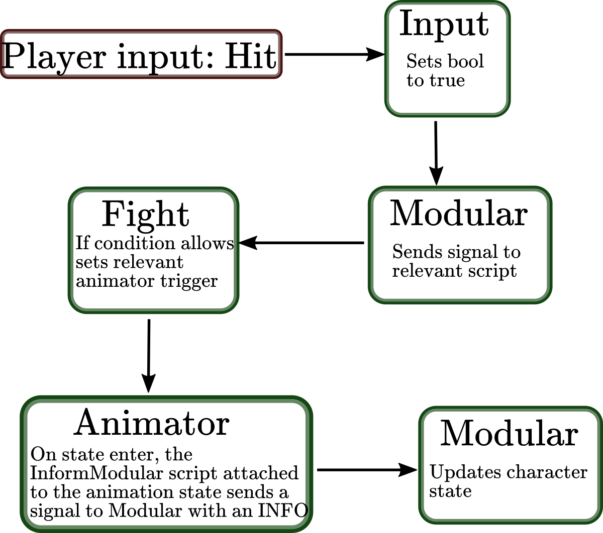

# Starter controller: How to use ? 

After months of struggling, I have finally designed a controller structure that, in my humble opinion and for beginners projects, is very well suited. 
To do so, I rely heavily on animation state machines, which allow to communicate with the animator, hence keeping track of what state the player is actually in. It may sound very trivial, but this is crucial and has hindered my small games for a long time in the past. 

I'm making a small guide on how to use to help interested people gain some time and also as a reminder to me, in order to prevent forgetting valuable informations. 

## Elements 

Basically, the structure relies the following elements: 

* `Modular`: The central hub 
* StateBehav folder: Holds various scripts for handling animation states
* `Move`: Manages the player's movement 
* `Fight`: Manage fighting states  
* `Hitbox`
* `CommonsUtils`

## Example process 

The information pipeline is as such: 

1. Player's input is recorded by the `Input` script. 
1. This information is accessed by the `Modular` script in the `Update` method
1. The relevant script is called (usually `Move` or `Fight`) 
1. Most of the time, a trigger for animation is set to true (ex: *hit, jump...*)
1. Most of the animation states hold a `InformModular` script with an *Information* field. This is filled by the user. 
1. When the animation state is accessed, the `InformModular` sends the information to `Modular` along with a boolean set to true when entering the state, and false when exiting. 
1. This state and information are used by `Modular` to update the character state. Usually, a specific method is set up to comply with needs (eg: OnJumpEnter will set rigidbody's drag to minimal value, apply the force and enable the additional gravity)

I've found the method to allow for easy extention and it handles rather well various character states. 

## The hitbox magic 

The wiring necessary for hitbox wasn't totally straightforward, so here's an explanation. 

* It relies on two main components: 
    * The Hitbox script, to be attached to triggers 
    * HitData data struct. Holds informations about the hit 

1. First, equip the hit animation states with a `HitInform` script. 
1. This script has a HitData field. In here, various informations have to be filled. 
1. When the state is entered, the `Modular.HitInform()` method is called, with the HitData as parameters
1. From here, the `Fight.Activation()` method is called. It sets the hitbox with corresponding name to an Active state. In this state, it will indeed generate an impact when touching something. 
1. When the state is exited, the same method is called, but this time it sets the hitbox to false.    

The other infrmations in HitData are used for applying an impulsion to the character, setting damage and force applied to enemy and so on. The HitData struct is located in the `CommonUtils` script. 